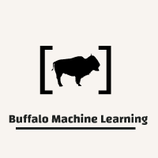

# BML_NFLSpreadBetting
## An NFL Spread Betting Project For our new self named team: Buffalo Machine Learning

The goal of this project is to analyze historical data to train an ensemble model to make predictions given spreads and current nfl data to automate  decision making and provide us with bets to place on spreads of nfl games.

## Members
* Owen Wurst
* AJ Burruano

To contribute to this project, reach out to Owen Wurst at OwenWurst82@gmail.com

